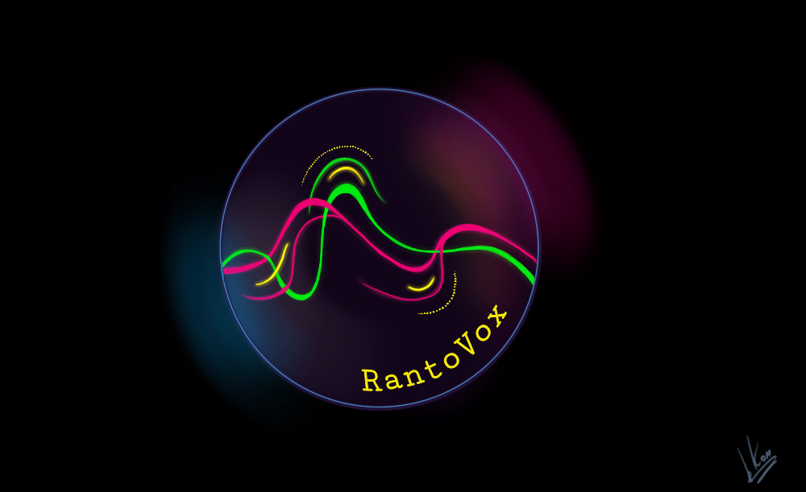

# RantoVox (Telegram bot)

Telegram bot based on Python 3.11 for running **Speech-To-Text (STT)** and **Text-To-Speech (TTS)** queries. Languages supported: **Russian**, **English** (queries and interface).

<p align='center'>
       
</p>

<p align='center'>
   <a href="https://t.me/RantoVoxBot">
       
    </a>
</p>


## Tech

### **Used modules**

Module for working with Telegram API: [Aiogram](https://pypi.org/project/aiogram/).

Software for converting audio files into different formats: [FFmpeg](https://ffmpeg.org/).

STT and TTS queries are performed using the following libraries:

* [Vosk](https://pypi.org/project/vosk/) (STT)
  
* [Pyttsx3](https://pypi.org/project/pyttsx3/) (TTS)

RantoVox supports two voices (male and female), whose names are set in the configuration file.

### **Extra Text Processing (ETP)**

RantoVox has a special function called **extra_text_processing**, which introduces additional methods of processing text received from [vosk](https://pypi.org/project/vosk/). By going through it, the text can be made more human and correct in terms of writing. The materials required for this function are stored strictly in the **src/etp**.

## Installation

> Note: **Requires [Python 3](https://www.python.org/)**

### **Installation manual**

The following steps are required for RantoVox to work correctly:

1) Clone the repository (download source code)

2) Install dependencies using pip with requirements.txt

3) Create your own **.env** file in bot folder with the **TELEGRAM_TOKEN** variable

4) Set preferred voice names in the configuration file (you can see the available ones with [pyttsx3](https://pypi.org/project/pyttsx3/) in your system, **note:** not all voices can synthesize Russian speech, additional third-party installation may be required)

5) Download latest [vosk](https://pypi.org/project/vosk/) russian and english language models (the small model is more preferable), drop them into **src/lang** and set their dirnames in configuration file (example: vosk-model-small-en-us-0.15)

6) Download and install [FFmpeg](https://ffmpeg.org/) in your system (don't forget to add it to PATH)

### **Cloning repository and installing requirments**

```bash
git clone https://github.com/Ggorets0dev/RantoVoxBot.git
cd RantoVoxBot
pip install -r requirements.txt
```

## Usage

### **Commands**

The following commands are available in RantoVox:

* **start** - Launch a bot for your account

* **help** - Get an informational summary of the operating principles

* **setlocale** - Set language of bot's interface

* **setvoice** - Set voice gender for requests (TTS)

* **setlang** - Set language for requests (STT)

### **Configuration file**

The following parameters can be changed in the RantoVox configuration file:

* Dirname of language models (must be in **src/lang**)

* Voiceover names for each supported language

* Names of special files required for ETP operation

* Tumbler to enable/disable ETP

## Data privacy

RantoVox deletes all temporary files immediately after a TTS or STT request. All conversion is done on the host with the help of the libraries described above. Only user's **Login** and **ID** are recorded in logs when requesting, composition of request remains hidden to host.
